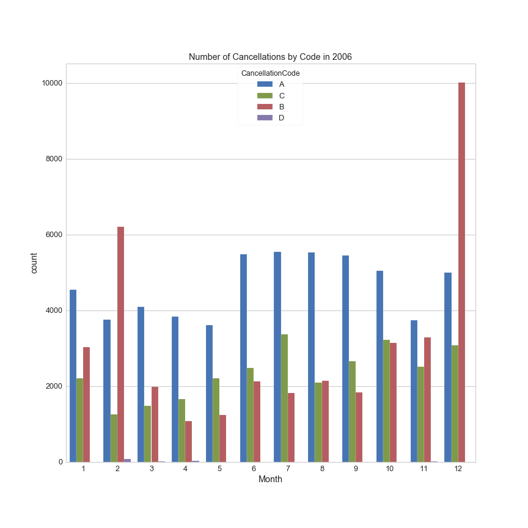
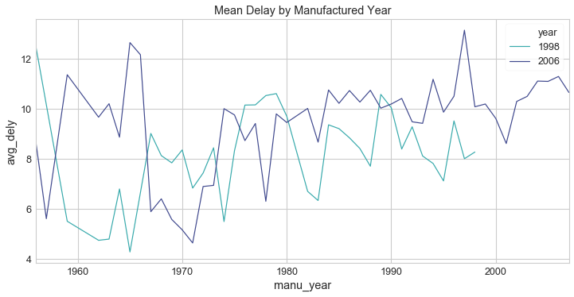

# Exploratory Data Analysis on Flight Dataset

This is an EDA on the infamous Flights Dataset.

## To Reproduce the result

- Run `downloadData.sh` to fetch original datasets and set up the working environment
- Put the datasets from `airlinesauxiliaryfiles.zip` provided with the assignment 
- Run `....hive` to generate the datasets used for plots (saved to the folder `generated_datasets`)
- Run `main.R` to generate plots (generated plots will be stored in the folder `plots`)
- Run `....py` to generate plots (*save plots?*)

## Built With

- [RStudio](https://www.rstudio.com/) - The framework we used to create the analysis
- Jupyter Notebook - The environment we used to create the Python portion
- Hive - The framework we used to wrangling large datasets

## Authors

- **Yoon Chang** - [Portfolio](https://yooniverse.me/)
- **Yi Xu**
- **Yingyi Lai**
- **Junyao Chen**

## Roadmap

### 1 Introduction (LY)

### 2 Wrangling (LY)
- byCarr (Hive)
- byModel (Hive)
- ...
### 3 Visualization & Analysis
#### 3.1  Feature Analysis 

##### 3.1.1 First glance of the features
*(LY) stream graph for each variable + num flights*
##### 3.1.2 Delay 
*(JC) (XY)*
- Monthly / Day of Week trend of departure/arrival delay

  - Look through the year

  First we make the following plot to show how average arrival delay time and departure delay time of each month change through the year for 1998 and 2006.

   

  As shown in the plot, all the lines generally follow the same trend for the first half of the year (January - June) and reach a peak at June. Then for June to December, 2006 generally have longer delay than 1998. For both of the two years, monthly average departure delays are longer than arrival delays. Base on this observation, we suspect there might be a relationship between the difference of expected time expansion minus actual time expansion and departure delay time. In another words, we wonder if departure delay can cause the flight spend less time to get the destination. We will take a deeper look into this in the case study **4.2**. We notice that there is a peak in June. Now let take another look into that. 

  The following plot shows the percentiles of departure delay in June for the two years.

  

  We can see from the plot that the departure delay for the two year roughly follow same distribution.

  - Look through the week

  Now we make the following plot to show how average arrival delay time and departure delay time of each day of week change through a week for 1998 and 2006.

  

  According to the plot, for each of day in a week except for Tuesday, average delay in 2006 is higher than it in 1998 .  Also we can see that Fridays have highest average delay time and Saturdays have lowest average delay time.  

- Reason of delay in 2006

  

This graph shows the total time of delay by reason in each month of 2006. The y-axis indicates the sum of delay time in the unit of minute. For the sum, June, July and December had higher values, while January and February had relatively lower ones. For these five delay reasons, the distributions of them in each month were similar. Late aircraft, NAS, and carrier were three common reasons leading to most delay time, and the weather did not cause too much delay, which is unexpected. Delay caused by security was rare that we can hardly see the blocks with darker color from the graph. 

We expected that there would be more delay time in winter, but actually June and July had the largest delay time caused by weather. Thus we might guess that some events or some extreme weather happened at that time. As we went back to the news, we found that there was a severe heat wave in 2006 summer that affected most of the United States and Canada, killing hundreds of people, and temperatures in many locations made the highest temperature records.

##### 3.1.3  Cancellation 

- Distribution Plots

  - Number of Cancellations by Month in 1998

    

    In the above plot, there is a clear spike in September of 1998, and the rest of the months stay consistent in its cancellation numbers. Although the exact cause is not known in the data, there was Swissair Flight 111 that crashed near Peggys Cove, Nova Scotia, which killed 229 people on board. 

    

  - Number of Cancellations by Code in 2006

    

    ```
    A = carrier, B = weather, C = NAS, D = security
    ```

    Generally, Code D (Secutiy) seems as it does not cancel flights much at all. Code A (Carrier) and Code C (NAS) stay consistent in their magnitudes among the causes of cancellation throughout the year. However, Code B (Weather) varies in its magnitude more dramatically depending on the month, spiking in December and February and calming down in summer months.

  

  - Distribution of Cancellation Codes

    

     Based on the charts above, Code A (Carrier) cancellation takes about half of all the cancellations  that occured in 2006. The second most common type is Code B (Weather), which is a bit more seasonal compared to the other two. Code D (Security) only takes 0.1% of all the cancellations.

  

  - Rate of Cancellation by Carrier

    

    In 1998, NW (NorthWest Airlines) definitely stands out from the rest in terms of its magnitude of cancellation rate. In 2006, the top three carriers with highest cancellation rates are MQ (
    American Eagle Airlines), YV (Mesa Airlines), and EV (Atlantic Southeast Airlines). 


#### 3.2  Multivariate Analaysis & General Trends

##### 3.2.1  Treemap Analysis (R) (JC) (YX)

We make the following treemaps to uncover span of the delays and cancellations over where the flight departure, which airline is the carrier and what kind of plane used for the flight.

- byState

The following 4 treemaps show the cancellation rate, delay rate, and average delay time for each state. For all the 4 plots, every small rectangle represents a state, the sizes of the rectangles represent the number of flights recorded. And the color of them in each plot show the value of the 3 measures just mentioned respectively.

First we notice the total number expanded from 1998 to 2006. California had the largest number of flights in both 1998 and 2006. 


In terms of cancellation rate, things were generally better in 2006 than it was in 1998. In year 1998, Mississippi and Minnesota had the worst cancellation rate. 


The 2 plots above tell us that people in Hawaii, Idaho and Montana are really since their flights almost never got delayed. On the other hand, our Illinois is one of the states where flight got delayed most.

- byCarrier

Now, lets find out flights of which carrier got cancelled or delayed most. For the 3 following treemaps, each rectangle stands for a carrier. First we notice that there are more carriers recorded in 2006 than in 1998. 


In terms of cancellation rate, NW had a really bad record in 1998, but it got better in 2006. In 2006, MQ was the carrier had highest cancellation rate.


According to the 2 treemaps above, HA and AQ had really low delay time and rate.

- byModel

The next two graphs show the relationships between cancellation rate and the plane model as well as the delay rate and the model type. The size of a square indicates the number of flights with that particular model. And a darker color indicates a larger ratio value.

For the two years, Boeing was the leading position of the number of flights. In 1998, McDonnell Douglas was in the second position while the ranking was lowered to the fifth in 2006. Embraer and Bombardier INC., which were not in the top 4 in 1998, became the second and third largest manufactures in 2006. The models in 1998 and 2006 differed a lot. Most old models were replaced by newer ones.


In 2006, most models in the top 8 manufactures had relatively low cancellation rates. On the contrary, large cancellation rates happened to flights with small manufactures. But this trend was not the same in 1998, the top several manufactures all had models with high cancellation rates.


This graph is not that interesting, because the colors are similar between models, manufactures and years. The delay rate was not affected significantly by models and manufactures.

##### 3.2.2 Correlation Heatmap Analysis (R) (Yoon)


 Some of the notable negative correlations include rate of delay & year and rate of cancellation & year.. As for the rate of delay and rate of cancellation versus delay, it makes sense that they would decrease over the years as airports and airlines stabilize and improve their procedures. Also, note the positive correlation between number of cancellation and number of delays versus number of flights. This is also natural since more flights could lead to more cancellations or delays. 


##### 3.2.3 Geographical Heatmap Analysis (Yoon)

- By Number of Flights

  

  Based on the above map, the top five states with most number of flights are California, Texas, Illinois, Florida, and Georgia. 


- By Rate of Cancellation

  

  Based on the above map, the top four states with the highest rate of cancelled flights are South Dakota, West Virginia, Michigan, and Maine.


- By Rate of Delay

  

  Based on the above plot, the top five states with the highest rate of cancelled flights are Illinois, Georgia, Michigan, Nevada, and Texas. It should be noted that the relative distribution of the above map follows a similar trend with the first geographical heatmap (By Number of Flights), which suggests that the rate of delay may be related to the number of flights in a certain state.


##### 3.2.4 Busiest airports (YL)

### 4 Case study
#### 4.1 delay ~  m_year (Yoon)



 Based on the graph above, the average delay times have sharp declines and inclines throughout all of the years. This may be due to several possible causes. Certain planes stop flying after some age, leading to sudden decrease and increase during the cycles when old planes stop flying and new planes start flying. Also, this may be due to the fact that the overall quality of the planes in a certain year is much more influential in the delay times, leading to sharp differences in each year/cycle.


### 5 Conclusion

## License

This project is licensed under the MIT License

## Acknowledgments

- Statistics 480: blah blah blah
- **Darren Glosemeyer**